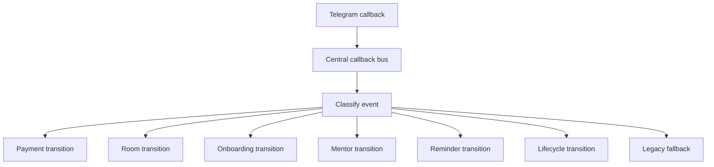

# Callback Map

This document describes how Telegram callbacks are categorized, dispatched, and translated into room / onboarding / reminder / mentor / payment transitions.

## Source Of Truth

- Callback bus: `backend/src/modules/telegram-mentor/services/telegram-event-bus.service.ts`
- Entry handler: `backend/src/modules/telegram-mentor/index.ts`
- Room engine: `backend/src/modules/telegram-mentor/services/product-room.service.ts`
- Onboarding handlers: `backend/src/modules/telegram-mentor/flows/*.ts`
- Payment handler: `backend/src/modules/telegram-mentor/handlers/billing.ts`

## Callback Categories

- payment
- room
- onboarding
- mentor
- reminder
- lifecycle
- navigation
- legacy

## Callback Flow

## Ownership Rules

### Payment callbacks

- Open checkout
- Start payment flow
- Payment product selection

### Room callbacks

- Open course room
- Open practices
- Restart flow
- Open dashboard-backed product room

### Onboarding callbacks

- Start trial
- Waitlist / early access
- Lead magnet continuation

### Mentor callbacks

- Resume mentor session
- Continue chat
- Continue mentor step

### Reminder callbacks

- Open task
- Complete task
- Skip task
- Dismiss reminder

## Transition Rule

Callbacks must not mutate product state directly.
They should dispatch an orchestration event and let the room/lifecycle resolver decide the new state.

## Idempotency Rule

Duplicate callback bursts should be deduplicated by the event bus before transitions run.
That prevents room and reminder state from being applied twice.
# Redirect note: callback architecture is migrating to `docs/architecture/callback-map.md`.
