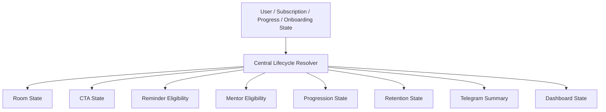

# Lifecycle Map

This document explains how lifecycle state moves across Telegram, SaaS, dashboard, reminders, and AI mentor flows.

## Source Of Truth

- Central lifecycle resolver: `backend/src/modules/lifecycle/service.ts`
- Legacy lifecycle source: `backend/src/modules/flow-control/service.ts`
- Room engine consumer: `backend/src/modules/telegram-mentor/services/product-room.service.ts`
- Summary consumer: `backend/src/modules/telegram-mentor/services/productSummary.service.ts`
- Reminder consumer: `backend/src/modules/telegram-mentor/services/nudge.service.ts`
- Mentor consumer: `backend/src/modules/telegram-mentor/handlers/aiMentor.ts`

## Lifecycle States

- guest
- onboarding
- trial
- active
- paused
- expired
- gifted
- bonus
- completed
- winback
- inactive

## Lifecycle Propagation

## Snapshot Payload

The lifecycle resolver emits one snapshot that contains:

- access state
- onboarding state
- room state
- activation state
- subscription state
- reminder eligibility
- mentor eligibility
- progression state
- retention state
- CTA state

## State Rules

### Guest

- No active access
- No mentor prompts
- No reminders
- CTA should stay low-friction

### Onboarding

- Access is not yet complete
- CTA should continue the onboarding journey
- Mentor can be soft or medium depending on context

### Trial

- Active access with time-boxed trial rules
- Reminders are allowed only if lifecycle says eligible
- CTA should continue, not restart

### Active

- Full access
- Progress and mentor are enabled
- CTA should continue or continue lesson

### Paused / Expired / Winback

- Access is not active
- CTA should restore, not sell blindly
- Reminders should be suppressed unless the lifecycle says otherwise

### Gifted / Bonus

- Access is special-source active access
- Room should open with the right product context
- Mentor mode should be softer by default

### Completed

- Onboarding or product flow is complete
- CTA can open or continue
- Mentor should avoid onboarding nudges

## Anti-Desync Rule

Telegram room state, dashboard state, reminders, and mentor behavior should all read from the same lifecycle snapshot.
If a mismatch appears, log it and recover from the central resolver.
# Redirect note: lifecycle architecture is migrating to `docs/architecture/lifecycle-map.md`.
