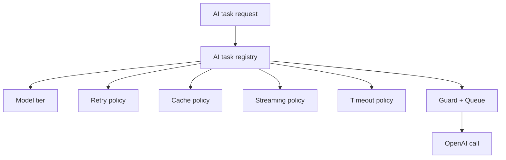

# AI Orchestration

This document is the visible map for AI task routing, model tiering, caching, retries, and cost control.

## Source Of Truth

- AI registry: `backend/src/platform/ai.registry.ts`
- AI runner: `backend/src/services/aiTaskRunner.service.ts`
- AI guard: `backend/src/services/aiGuard.service.ts`
- Queue: `backend/src/services/aiQueue.service.ts`

## Task Tiers

- cheap
- balanced
- premium

## Task Routing

## Registered Tasks

- mentor_reply
- weekly_insight
- daily_analysis
- web_map_adaptation
- task_priority
- banner_generation
- assistant_weekly_insight
- lead_magnet_copy

## Cost Control Rules

- Cheap tasks handle microcopy, reminders, short nudges, and lightweight selections.
- Balanced tasks handle summaries, insights, and standard mentor responses.
- Premium should only be used when the response is truly long-form or strategic.
- Cached tasks should not re-run within their TTL window.

## Caching And Deduplication

- The runner checks cache first.
- The guard prevents duplicate in-flight work.
- The queue limits concurrency.
- The registry declares task TTL and retry policy.

## Performance Rules

- Never call expensive models for trivial CTA or reminder copy.
- Reuse weekly summaries when the same user payload repeats.
- Reuse mentor summaries when the same prompt hash repeats.
- Keep high-frequency tasks on cheap or balanced tiers.

## AI Mentor Orchestration

AI mentor behavior should be:

- product-aware
- lifecycle-aware
- non-spammy
- cache-backed
- retry-limited

That keeps mentor behavior stable while controlling token usage.
