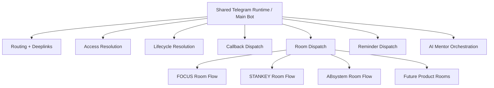
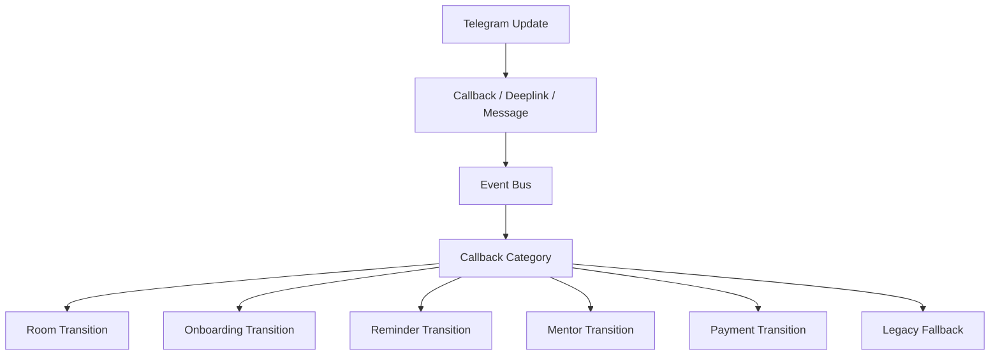
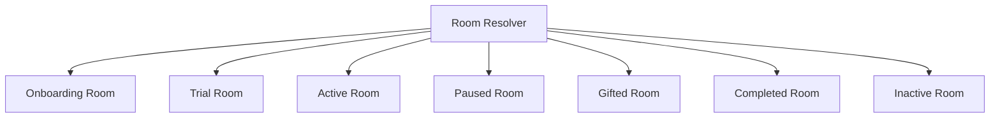
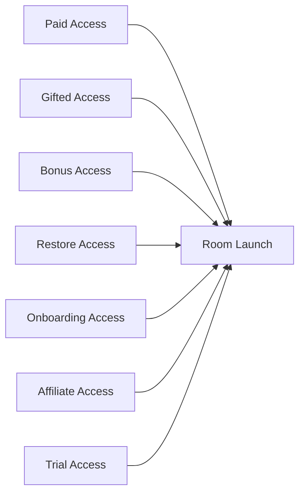

# Telegram Platform Architecture

This document is the operational map for the Telegram platform.
It describes the runtime hierarchy, room ownership, callback ownership, deeplink access, and how new products should plug in without copying architecture.

## Source Of Truth

- Product registry: `backend/src/platform/ai.registry.ts` and `backend/src/platform/index.ts`
- Bot registry: `backend/src/platform/bot.registry.ts`
- Cron registry: `backend/src/platform/cron.registry.ts`
- Telegram event bus: `backend/src/modules/telegram-mentor/services/telegram-event-bus.service.ts`
- Room engine: `backend/src/modules/telegram-mentor/services/product-room.service.ts`
- Lifecycle resolver: `backend/src/modules/lifecycle/service.ts`

## Bot Hierarchy

## Bot Roles

### Main Bot

- Owns orchestration
- Resolves access and lifecycle state
- Dispatches callbacks
- Dispatches room transitions
- Handles deeplinks
- Coordinates reminders
- Coordinates AI mentor actions

### STANKEY Flow

- Telegram-first onboarding
- Lessons and progression
- Reminders
- Gamification
- Restore flow
- Payment-linked activation

### AI Mentor Flow

- Coaching and nudges
- Retention and winback
- Upsell orchestration
- Behavior adaptation
- Lifecycle-aware delivery

## Event Hierarchy

## Room Hierarchy

## Deeplink And Access Flow

## Product Ownership Rules

- Add a product to the registry first.
- Add its room config next.
- Add callback categories only if the product needs new transitions.
- Add reminder profiles only if the product owns reminders.
- Add AI task config only if the product needs a new AI behavior or model tier.
- Keep the main bot runtime shared.
- Do not create a separate bot runtime unless the product truly needs its own ownership boundary.

## Scaling Rule

To add a future product:

1. Register product metadata.
2. Define room state + CTA rules.
3. Add deeplink/access rules.
4. Map callbacks to the event bus.
5. Add reminder ownership to cron registry.
6. Add AI task config if needed.

That keeps scaling config-driven instead of architecture-driven.
