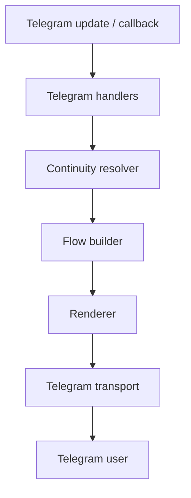
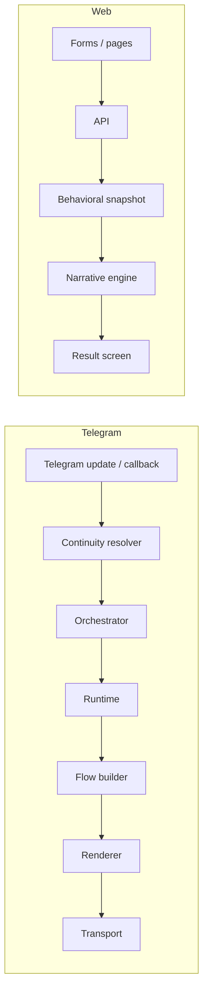

# System Route Map

Static audit scope:
- Backend route definitions scanned from `backend/src/app.ts`, `backend/src/index.ts`, and all `router.*` declarations under `backend/src/**`
- Web route declarations scanned from `apps/web/src/App.tsx` plus route consumers / API call sites in feature code
- Telegram flow audit includes the bot webhook entrypoint, ABSystem Telegram handlers, recovery paths, and scheduled reminder flows

Route counts from the static scan:
- Backend route handler definitions: `268`
- Web route declarations / route-consumer entries: `63`
- Note: `backend/src/modules/funnel/routes.ts` and `backend/src/modules/stats/routes.ts` were discovered in the codebase but are not mounted in `backend/src/app.ts` during this audit, so they are treated as latent route files, not active request surfaces

## Backend API

Access mode legend used in this audit:
- `PUBLIC` = no authenticated session required
- `ACTIVE` = full access, including writes / premium flows
- `CONTINUITY` = read historical movement / continuity artifacts only
- `LOCKED` = access denied unless access is restored
- `MIXED` = route family contains both read and write surfaces with different access modes

| Route | Method | Module | Handler | Middleware | Auth | Access Mode | DB Queries | Used By | Notes |
| --- | --- | --- | --- | --- | --- | --- | --- | --- | --- |
| `/` `/health` `/health/ready` `/health/live` `/api/telegram/webhook` | `GET` / `POST` | `backend/src/app.ts` `backend/src/index.ts` `backend/src/routes/health.ts` | inline health handlers `bot.handleUpdate(req.body, res)` | none | `PUBLIC` | `PUBLIC` | none | load balancer, ops checks, Telegram Bot API | root + health are cheap; Telegram webhook is the transport entrypoint and should stay thin |
| `/api/auth/register` `/api/auth/login` `/api/auth/social` `/api/auth/telegram` `/api/auth/refresh` `/api/auth/logout` `/api/auth/me` `/api/auth/settings` `/api/auth/telegram-link` `/api/telegram/retry-link` `/api/telegram/status` | `POST` / `GET` / `PATCH` | `backend/src/modules/auth/auth.routes.ts` | `register`, `login`, `social`, `telegram`, `refresh`, `logout`, `getMe`, `updateSettings`, `telegramRouter` handlers | `authLimiter` on auth entrypoints; `authRequired` on account endpoints | mixed | `ACTIVE` for authenticated account ops | `users`, `telegramLink`, cache lookups, notification prefs | primary auth/session bootstrap path; `sessionSync.ts` and `useAuth.ts` both hit `refresh`/`me` patterns; Telegram binding status is also consumed by the web Telegram page |
| `/api/access/me` `/api/access/state` `/api/access/user/:userId` `/api/access/grant` `/api/access/revoke` | `GET` / `POST` | `backend/src/modules/access/routes.ts` | access control handlers | `authRequired` | `ACTIVE` | `ACTIVE` | access control state, product access joins, subscription status | session bootstrap, admin tools, dashboard guards | control-plane route family; very often refreshed after auth restore |
| `/api/analytics/stats` `/api/analytics/overview` `/api/analytics/behavioral` `/api/analytics/funnel` `/api/analytics/founder` `/api/analytics/questions` `/api/analytics/retention` `/api/analytics/insights` `/api/analytics/live` `/api/analytics/journey/:userId` `/api/analytics/intelligence` `/api/analytics/intelligence/product/:productId` `/api/analytics/governance` `/api/analytics/launch` `/api/analytics/release` `/api/analytics/activation` `/api/analytics/feature-flags` `/api/analytics/banners` `/api/analytics/banners/generate` | `GET` / `POST` | `backend/src/modules/analytics/routes.ts` | analytics controllers | `authRequired`; some endpoints add `productOwnerGuard` | `ACTIVE` | heavy aggregation / reporting | `apps/web/src/features/analytics/pages/AdminAnalytics.tsx`, product ops, founder dashboards | high-cost reporting surface; most likely to fan out over multiple aggregates and repeated refetches |
| `/api/events/track` | `POST` | `backend/src/modules/events/routes.ts` | `ingestEvent` | none | `PUBLIC` / service-auth via payload trust | `ACTIVE` | append-only event ingest | web telemetry, bot telemetry, notifications, analytics | low read pressure, but high volume |
| `/api/deeplinks/generate` `/api/deeplinks/telegram` `/api/deeplinks/resolve` `/api/deeplinks/resolve-session` | `POST` / `GET` | `backend/src/modules/deeplinks/routes.ts` | deep-link handlers | `authRequired` on protected endpoints | mixed | `ACTIVE` | link tables, session lookups | auth flows, Telegram binding, Telegram runtime | medium-frequency identity bridge |
| `/api/experts` routes | `GET` / `POST` / `PUT` / `DELETE` | `backend/src/modules/experts/routes.ts` | expert management handlers | `authenticate` | `ACTIVE` | `ACTIVE` | expert profile tables, subscriptions, bot linkage | expert console, product ops | large self-contained module; not continuity-aware |
| `/api/five-points/enrollment` `/api/five-points/enroll` `/api/five-points/progress` | `GET` / `POST` / `PATCH` | `backend/src/modules/five-points/routes.ts` | five-points handlers | `authRequired`, `requireLeadAccess({ allowStart: true })` | `ACTIVE` / `LOCKED` | `LOCKED` until lead access; then `ACTIVE` | lead/access tables, progress records | onboarding / trial funnel | lead-gated funnel surface |
| `/api/products/my` `/api/products/my/list` `/api/products/:id/enroll` `/api/products/:id/access` `/api/products/` `/api/products/:id` | `GET` / `POST` / `PUT` / `DELETE` | `backend/src/modules/products/routes.ts` | product CRUD + access handlers | `authRequired` | `ACTIVE` | `ACTIVE` | product catalog, product access joins | dashboard, admin product management | used by product and access control surfaces |
| `/api/product-members/*` | `GET` and membership writes | `backend/src/modules/product-members/routes.ts` | membership handlers | auth / ownership guards (module-specific) | `ACTIVE` | `ACTIVE` | membership tables | admin/product ops | route group present in app mount, used for product membership management |
| `/api/progress/` `/api/progress/:userId` | `GET` / `PUT` | `backend/src/modules/progress/routes.ts` | progress handlers | `authRequired` + `requireBehavioralReadAccess('progress')` on reads; `requireClientAccess` on writes | mixed | `CONTINUITY` for reads, `ACTIVE` for writes | progress rows, user history | dashboard journal/progress pages, Telegram continuity | one of the continuity-protected read surfaces |
| `/api/notifications/diagnostics/catalog` `/api/notifications/diagnostics/status` `/api/notifications/session-handoff` `/api/notifications/diagnostics/morning` `/api/notifications/diagnostics/evening` `/api/notifications/diagnostics/event` `/api/notifications/diagnostics/day-flow` `/api/notifications/diagnostics/trial-expired-flow` `/api/notifications/me` `/api/notifications/me/read-all` `/api/notifications/:userId` `/api/notifications/:id/read` `/api/notifications/:userId/read-all` `/api/notifications/:id` | various | `backend/src/modules/notifications/routes.ts` | notification handlers | `authRequired` | `ACTIVE` | notification tables, preference rows | dashboard notifications, session handoff, Telegram followups | diagnostics are admin-ish, but all still go through auth |
| `/debug/mentor` `/debug/orchestrator` `/debug/db-audit` | `POST` / `GET` | `backend/src/modules/mentor/mentor.debug.router.ts` `backend/src/modules/debug/db.audit.router.ts` | debug handlers | none / internal auth checks inside handlers | `ACTIVE` | `ACTIVE` | depends on debug payloads | internal QA / debugging only | not user-facing; should be excluded from product metrics |
| `/api/mentor/session/:sessionId?` `/api/mentor/history` `/api/mentor/context` `/api/mentor/insight` `/api/mentor/daily-entry` `/api/mentor/daily-entry/latest` `/api/mentor/daily-entry/today` `/api/mentor/daily-cycle` `/api/mentor/wheel` `/api/mentor/trial/status` `/api/mentor/paid/status` `/api/mentor/micro-tasks` `/api/mentor/micro-tasks/manual` `/api/mentor/micro-tasks/replace` `/api/mentor/micro-tasks/:id` `/api/mentor/micro-tasks/:id/complete` `/api/mentor/micro-tasks/:id/skip` `/api/mentor/micro-tasks/:id/progress` `/api/mentor/micro-tasks/:id/step` `/api/mentor/setup/progress` `/api/mentor/setup/wheel` `/api/mentor/setup/questions/generate` `/api/mentor/setup/questions` `/api/mentor/setup/complete` `/api/mentor/morning` `/api/mentor/evening` `/api/mentor/chat-legacy` `/api/mentor/chat` `/api/mentor/wheel-analysis` `/api/mentor/weekly` `/api/mentor/pdf-report` `/api/mentor/weekly-report` `/api/mentor/context/:userId` | `GET` / `POST` / `PATCH` / `DELETE` | `backend/src/modules/ai-mentor/routes.ts` + `backend/src/modules/ai-mentor/weekly-analysis/routes.ts` | mentor / AI mentor controllers | `authRequired`; many read routes use `requireBehavioralReadAccess('continuity_artifacts' | 'daily_history' | 'daily_today')`; writes use `requireClientAccess`; generation routes use `requireGenerationQuota`; `productOwnerGuard` on weekly report | `MIXED` | `CONTINUITY` on historical reads, `ACTIVE` on generation/writes, `LOCKED` when no access | daily entries, wheel, mentor memory, microtasks, weekly reports, context, PDF report generation | largest behavioral continuity cluster in the backend; also the biggest candidate for duplicate reads and N+1 pressure |
| `/api/aIMentor/*` | same as `/api/mentor/*` | `backend/src/modules/ai-mentor/routes.ts` mounted twice | same handlers as mentor routes | same as above | mixed | mixed | same as above | legacy alias and compatibility consumers | duplicate namespace mount; useful for compatibility, but increases route surface area |
| `/api/ai/chat` `/api/ai/actions/morning` `/api/ai/actions/evening` | `POST` | `backend/src/modules/ai/routes.ts` | AI controller methods | `authOrBotRequired` + `requireClientAccess` | `ACTIVE` | `ACTIVE` | AI conversation writes, action orchestration | assistant / mentor surfaces | separate AI surface from mentor alias; still active access only |
| `/api/onboarding/progress` `/api/onboarding/complete-stage` `/api/onboarding/update-progress` `/api/onboarding/can-access/:stage` | `GET` / `POST` | `backend/src/modules/onboarding/routes.ts` | onboarding controller | `authRequired`; `requireOnboardingStage('SETUP')` on completion | `ACTIVE` | `ACTIVE` | onboarding state rows | login / first-run web flow | lifecycle-heavy; a likely source of “onboarding” wording in UX |
| `/api/journal/range` `/api/journal/` | `GET` | `backend/src/modules/journal/routes.ts` | journal handlers | `authRequired` | `CONTINUITY` | `CONTINUITY` | journal events, date-range queries | dashboard journal, progress pages | read-only history surface |
| `/api/wheel/` `/api/wheel/cooldown` `/api/wheel/history` `/api/wheel/latest` `/api/wheel/analytics` `/api/wheel/:id/telegram-reminder` `/api/wheel/:id/pdf` | `POST` / `GET` | `backend/src/modules/wheel/routes.ts` | wheel handlers | `authRequired`; `requireClientAccess` for writes / reminders / PDF; `requireBehavioralReadAccess(...)` for history/latest/cooldown/analytics | mixed | `CONTINUITY` for read surfaces, `ACTIVE` for writes | wheel assessment rows, analytics, PDF generation | hot path for continuity reads; PDF generation is expensive; reminder action can fan out to Telegram/notification transport |
| `/api/vision/` | `GET` / `POST` / `PUT` | `backend/src/modules/vision/routes.ts` | vision handlers | `authRequired` + `requireClientAccess` | `ACTIVE` | `ACTIVE` | vision records | dashboard strategy / point-B page | another write-heavy product surface |
| `/api/goals/` `/api/goals/primary` `/api/goals/check-alignment` | `GET` / `POST` | `backend/src/modules/goals/routes.ts` | goals handlers | `authRequired`; `requireBehavioralReadAccess('goals' | 'goals_primary')` on reads; `requireClientAccess` on writes | mixed | `CONTINUITY` for reads, `ACTIVE` for writes | goals sets, alignment logic | dashboard goals, Telegram continuity | continuity-protected read surface; one of the most user-visible places where access mode matters |
| `/api/trial/start` `/api/trial/status` `/api/trial/mirror` | `POST` / `GET` | `backend/src/modules/trial/routes.ts` | trial handlers | `authRequired` | `ACTIVE` | `ACTIVE` | trial state, mirror payloads | onboarding and subscription flow | coupled to lifecycle and paywall messaging |
| `/api/user/` `/api/user/:id/role` `/api/user/:id/settings` `/api/user/email` `/api/user/state` | `GET` / `PUT` / `PATCH` | `backend/src/modules/user/routes.ts` + `backend/src/modules/user-state/routes.ts` | user handlers | `authRequired` / `authOrBotRequired` | `ACTIVE` | `ACTIVE` | user rows, settings, state rows | auth, profile, Telegram runtime | duplicate namespace mount on `/api/user` in `app.ts` |
| `/api/quota/me` `/api/quota/purchase` | `GET` / `POST` | `backend/src/modules/quota/routes.ts` | quota handlers | `authRequired` | `ACTIVE` | `ACTIVE` | quota rows, purchases | generation gating, AI flows | likely to be read on every paid interaction |
| `/api/affiliate/create` | `POST` | `backend/src/modules/affiliate/routes.ts` | affiliate handler | `authRequired` | `ACTIVE` | `ACTIVE` | affiliate records | growth / referral tooling | small but sensitive commerce surface |
| `/api/lead-magnet/register` `/api/lead-magnet/status` `/api/lead-magnet/generate-ads` | `POST` / `GET` | `backend/src/modules/lead-magnet/routes.ts` | lead-magnet handlers | `register` public, others `authRequired` / `authenticate` | mixed | `ACTIVE` | lead-magnet records, ad generation | funnel and landing flows | classic acquisition funnel surface |
| `/api/settings/` | `GET` / `PUT` | `backend/src/modules/settings/routes.ts` | settings handlers | `authRequired` | `ACTIVE` | `ACTIVE` | user settings rows | app shell / profile / theme sync | often refreshed by web settings page |
| `/api/gamification/profile` `/api/gamification/streak` `/api/gamification/summary` `/api/gamification/events` | `GET` / `POST` | `backend/src/modules/gamification/routes.ts` | gamification handlers | `authOrBotRequired` | `ACTIVE` | `ACTIVE` | gamification state, events | dashboard / Telegram / legacy surfaces | explicit streak route is a UX contamination risk if surfaced raw |
| `/api/start-flow/` | `POST` | `backend/src/modules/start-flow/routes.ts` | start-flow controller | `authRequired` | `ACTIVE` | `ACTIVE` | flow runtime rows | onboarding / bootstrapping | lifecycle start node |
| `/api/consultation/triggers` `/api/consultation/book` `/api/consultation/my` `/api/consultation/:id/status` | `GET` / `POST` / `PATCH` | `backend/src/modules/consultation/routes.ts` | consultation handlers | `authRequired` | `ACTIVE` | `ACTIVE` | consultation tables | booking / CRM-like user flows | likely a business-side flow, not continuity-aware |
| `/api/ab-test/questions` `/api/ab-test/submit` | `GET` / `POST` | `backend/src/modules/ab-test/routes.ts` | AB test route handlers | none | `PUBLIC` | `PUBLIC` | content-only on questions; behavioral snapshot / narrative on submit | `apps/web/src/features/ab-test/pages/AbTestPage.tsx` | first working behavioral loop; submit returns `dominantBlock`, `unresolvedGoal`, `repeatedPostponedAction`, `inactivityDays`, `narrative`, `nextAction`, `nextActionCta` |
| `/api/zoom/session` `/api/zoom/upcoming` `/api/zoom/register` `/api/zoom/attendee/attended` `/api/zoom/session/:sessionId/report` `/api/zoom/session/:sessionId/attendees` `/api/zoom/my` | `POST` / `GET` / `PATCH` | `backend/src/modules/zoom/routes.ts` | zoom handlers | `authRequired` | `ACTIVE` | `ACTIVE` | zoom session / attendee / report tables | Focus, mentorship, Telegram reminders | participation is also used as continuity signal |
| `/api/mentorship/access` `/api/mentorship/active` `/api/mentorship/` `/api/mentorship/activate` `/api/mentorship/:id/pause` `/api/mentorship/:id/resume` `/api/mentorship/:id/complete` `/api/mentorship/:id/cancel` | `GET` / `POST` / `PATCH` | `backend/src/modules/mentorship/routes.ts` | mentorship handlers | `authRequired` | `ACTIVE` | `ACTIVE` | mentorship records | paid coaching lifecycle | lifecycle-heavy, should stay isolated from ABSystem copy |
| `/api/courses/recommendations` `/api/courses/` `/api/courses/:id` `/api/courses/enroll` `/api/courses/my/enrollments` | `GET` / `POST` | `backend/src/modules/mini-courses/routes.ts` | mini-course handlers | `authRequired` on gated surfaces | `ACTIVE` | `ACTIVE` | course catalog, enrollment tables | product / learning pages | separate learning surface, not continuity-first |
| `/api/social/connections` `/api/social/connect` `/api/social/disconnect` `/api/social/telegram/link` `/api/social/telegram/verify` | `GET` / `POST` | `backend/src/modules/social/routes.ts` | social handlers | `authRequired` on most; verify is public | mixed | `ACTIVE` | social link rows, Telegram verification rows | Telegram miniapp / social onboarding | identity/linking bridge |
| `/api/subscriptions/payments/wayforpay/callback` `/api/subscriptions/payments/wayforpay/checkout` `/api/subscriptions/status` `/api/subscriptions/` `/api/subscriptions/grants/activate` `/api/subscriptions/payments/wayforpay/initiate` `/api/subscriptions/test/superadmin/trial` `/api/subscriptions/test/superadmin/payment` | `POST` / `GET` | `backend/src/modules/subscriptions/routes.ts` | subscription / payments handlers | `authRequired` on internal actions; WayForPay callback is public webhook | mixed | `ACTIVE` | subscription, grant, payment, webhook rows | checkout pages, paywalls, admin tests | do not touch in behavioral routing; this is the billing contract surface |
| `/api/payments/wayforpay/webhook` `/api/payments/wayforpay/checkout` | `POST` / `GET` | `backend/src/app.ts` + `backend/src/modules/subscriptions/payments/*` | direct webhook + checkout page handler | public webhook, checkout page public | `PUBLIC` | `PUBLIC` for webhook / page | payment rows, signature verification, grant activation | WayForPay callbacks, payment redirect flow | duplicated payment surface from the subscriptions module; keep it in the route map because it is a real exposed endpoint |
| `/api/landing/cards` `/api/landing/pay` | `GET` / `POST` | `backend/src/modules/landing/routes.ts` | landing handlers | none shown in route layer; controller checks internally | `PUBLIC` / `ACTIVE` | `PUBLIC` or `ACTIVE` depending on handler | landing card rows, payment intent rows | website landing pages | user-facing acquisition surface |
| `/api/assistant/chat` | `POST` | `backend/src/modules/assistant/routes.ts` | assistant chat handler | `authenticate` + `requireClientAccess` | `ACTIVE` | `ACTIVE` | chat / assistant rows | web assistant UI | not continuity-aware; separate from ABSystem behavioral layer |
| `/api/billing/pay` `/api/billing/webhook` | `POST` | `backend/src/modules/billing/billing.module.ts` | billing handlers | `authRequired` on pay; webhook public | mixed | `ACTIVE` | payment rows, webhook rows | checkout flow / payment callbacks | separate billing module from subscriptions; keep both in the map |
| `/api/users/` `/api/users/:id/role` `/api/users/:id/settings` `/api/users/email` | `GET` / `PATCH` / `PUT` | `backend/src/modules/user/routes.ts` | user management handlers | `authRequired` | `ACTIVE` | `ACTIVE` | user tables, settings rows | profile/settings/admin | note the duplicate `/api/user` and `/api/users` namespaces |
| `/api/admin/*` | multiple `GET` / `POST` / `PUT` / `PATCH` / `DELETE` | `backend/src/modules/admin/routes.ts` | admin module handlers | `authRequired` | `ACTIVE` | `ACTIVE` | many admin / content / prompt / user / ownership tables | admin dashboard, content studio, governance | largest administrative surface; expensive and broad |
| `/api/daily/today` `/api/daily/entry` `/api/daily/morning/answer` `/api/daily/session/:entryId/answer` `/api/daily/skip` `/api/daily/history` `/api/daily/tasks` `/api/daily/tasks/:taskId/complete` | `GET` / `POST` / `PATCH` | `backend/src/modules/daily-cycle/routes.ts` | daily-cycle handlers | `authOrBotRequired`; `requireBehavioralReadAccess('daily_today' | 'daily_history')` on reads; `requireClientAccess` on writes | mixed | `CONTINUITY` for reads, `ACTIVE` for writes | daily entries, tasks, history | major continuity surface and a common source of repeated read checks |
| `/api/web-map/` `/api/web-map/generate` `/api/web-map/goals/:id` `/api/web-map/analysis` `/api/web-map/daily-question` | `GET` / `POST` / `PUT` | `backend/src/modules/web-map/web-map.router.ts` | web-map handlers | `authenticate` | `ACTIVE` | `ACTIVE` | web-map / goal analysis rows | behavioral planning, dashboard wizardry | product planning surface, not route-light |

### Backend route map notes

- `backend/src/app.ts` mounts the active route graph and also duplicates some namespaces on purpose: `/api/mentor` is mounted twice (`mentorRoutes` + `mentorWeeklyAnalysisRoutes`), `/api/aIMentor` is an alias for `mentorRoutes`, and `/api/user` is mounted twice (`userStateRoutes` + `userRoutes`)
- `backend/src/index.ts` contains the direct Telegram webhook attachment when the bot is in webhook mode
- `backend/src/routes/health.ts` defines health routes in a separate router bundle, but `backend/src/app.ts` also exposes a root `/health` check directly
- The largest continuity-protected read cluster is `daily` / `wheel` / `goals` / `progress` / `ai-mentor`, all of which ultimately depend on `backend/src/core/access/behavioralAccess.ts`

## Telegram Flows

| Trigger | Handler | Runtime | Continuity | Renderer | Transport |
| --- | --- | --- | --- | --- | --- |
| `/api/telegram/webhook` | `bot.handleUpdate` from `backend/src/index.ts` | Telegram update runtime, bot config, polling/webhook mode | dispatches into the bot event bus and continuity-aware handlers | `backend/src/core/behavioral/behavioralNarrative.ts`, `backend/src/core/rendering/*` | Telegraf `bot.telegram.*` |
| `/start` | `backend/src/modules/telegram-mentor/handlers/start.ts` | ABSystem start flow, legacy compatibility branches | `resolveBehavioralContinuity`, `behavioralSnapshot`, `productSummary` | behavioral narrative + renderer-backed Telegram copy | bot reply / edit |
| `/status` | `backend/src/modules/telegram-mentor/handlers/status.ts` | status / recap flow | `resolveBehavioralContinuity` | behavioral narrative + content registry | bot reply / edit |
| `ab_test:start` `ab_test:restore` `ab_test:menu` `ab_test_answer:*` | `backend/src/products/ab-system/telegram/abTest.service.ts` | AB test progress, replay protection, timer scheduling | existing AB test foundation + new behavioral snapshot / narrative in the web loop | Telegram AB test UX from `abTest.content.ts` and buttons | reply / edit + callbacks |
| `return_main_menu` / other CTA callbacks | mentor / AB test CTA routers | runtime callback integrity and replay protection | continuity re-entry and product-stage handling | registry-backed button labels | bot callback answers |
| Payment confirmations / grants / checkout replies | billing + subscriptions handlers | payment lifecycle, grant activation, WayForPay callbacks | access state and product stage, not behavioral continuity | billing / subscription copy | webhook + bot notifications |
| Reminder timers | `notificationService.schedule` + notification handlers | scheduled reminders and followups | continuity-aware followup triggers when relevant | content registry / followup copy | notifications + bot messages |
| Zoom reminders / attendance / session followup | `backend/src/modules/zoom/routes.ts` + notification flows | Zoom session state | focus participation is also a continuity signal | renderer-backed reminder text | bot + notifications |
| Recovery / stale callback / interrupted flow | `conversationPresentation.ts`, `start.ts`, `status.ts`, `daily-cycle/telegram.ts` | recovery state, stale callback handling | continuity-aware fallback, return-after-gap, unresolved action recovery | renderer-backed copy, not handler-owned text | bot reply / edit |
| Focus continuation / re-entry | mentor / ABSystem flow handlers | focus / live-practice state | Focus participation, Zoom topic, last meaningful movement | continuity narrative | bot messages |

### Telegram flow map

## Web Routes

The web route inventory is grouped by canonical user-facing surface. Nested dashboard routes are intentionally listed together because they share one shell and one auth/access model.

| Route | Page | API Dependencies | Behavioral Logic |
| --- | --- | --- | --- |
| `/ab-test` | `apps/web/src/features/ab-test/pages/AbTestPage.tsx` | `GET /api/ab-test/questions` `POST /api/ab-test/submit` | answer 8 questions, build behavioral snapshot, render narrative result, single CTA loop |
| `/` | `apps/web/src/pages/HomePage.tsx` or redirect shell | route redirect only | public entry redirect to focus or dashboard depending on mode |
| `/login` | `LoginPage` | `/api/auth/login`, `/api/auth/register`, `/api/auth/social`, `/api/auth/telegram` via auth hooks | auth bootstrap and account recovery |
| `/auth/telegram/success` | `TelegramSuccessPage` | `/api/auth/telegram-link`, `/api/telegram/status` | Telegram binding confirmation |
| `/onboarding/start` | `StartFlowPage` | `/api/onboarding/*`, `/api/access/state`, `/api/trial/status` | lifecycle onboarding and first-run activation |
| `/onboarding/continue` | `ContinueFlowPage` | onboarding + access refresh | resume after Telegram or partial onboarding |
| `/wheel/start` | `WheelStartPage` | `/api/wheel/*`, `/api/goals/*`, `/api/subscriptions/*` | wheel entry, continuation, paid continuation prompts |
| `/reset-password` | `ResetPasswordPage` | auth reset endpoints | account recovery |
| `/dev/routes` | `DevRoutes` | local-only tools | developer navigation / route inspection |
| `/products/:slug` | `ProductInfoPage` | `/api/products/*`, subscription CTA endpoints | product landing / upsell |
| `/miniapp` and `/miniapp/*` | `MiniAppPage` | `/api/social/*`, `/api/telegram/*`, `/api/events/track`, `/api/miniapp/*` | Telegram web-app entrypoint |
| `/help` `/about` `/blog` `/careers` `/contact` `/faq` `/privacy` `/terms` `/cookies` | `InfoPage` | content/navigation only | public info pages |
| `/app` | redirect shell | route redirect | dashboard entry |
| `/dashboard` | `DashboardPage` | `access/me`, `access/state`, `wheel`, `goals`, `vision`, `daily`, `progress`, `subscription`, `notifications` | core app shell / route hub |
| `/dashboard/ai-mentor` | `AiMentorDashboardPage` | `/api/mentor/*`, `/api/ai-mentor/*`, `/api/ai/*` | mentor workspace / tasks / continuity |
| `/dashboard/cycle` | `AiMentorDashboardPage` | `/api/daily/*`, `/api/mentor/*` | daily cycle shell |
| `/dashboard/wheel` | `WheelPage` | `/api/wheel/*` | wheel continuity, history, analytics |
| `/dashboard/journal` | `JournalPage` | `/api/journal/*`, `/api/progress/*` | progress / journal recap |
| `/dashboard/calendar` | `AiMentorDashboardPage` | `/api/mentor/*` | calendar-like shell, route reuse |
| `/dashboard/microtasks` | `AiMentorDashboardPage` | `/api/microTask/*`, `/api/mentor/*` | microtask shell |
| `/dashboard/tasks` | `AiMentorDashboardPage` | `/api/daily/tasks`, `/api/microTask/*` | task shell |
| `/dashboard/progress` | redirect to journal | `/api/progress/*` | legacy alias |
| `/dashboard/vision` | `VisionPage` | `/api/vision/*` | strategy / point-B route |
| `/dashboard/goals` | `GoalsPage` | `/api/goals/*` | goals planning and continuity |
| `/dashboard/goals/trial-mirror` | `TrialMirrorPage` | `/api/trial/*`, `/api/goals/*` | trial-to-paid mirror path |
| `/dashboard/goals/weekly-mirror` | `WeeklyMirrorPage` | `/api/weekly-analysis/*`, `/api/goals/*` | weekly behavioral mirror |
| `/dashboard/actions` | `ActionsPage` | `/api/goals/*`, `/api/mentor/*` | action planning / escalation |
| `/dashboard/courses` | `CoursesPage` | `/api/courses/*`, subscription / paywall endpoints | learning / practice surface |
| `/dashboard/ai-seo` `/dashboard/ads` `/dashboard/leadmagnet` `/dashboard/students` | dashboard redirects | dashboard / products / admin endpoints | admin section shims |
| `/dashboard/admin/users` `/dashboard/admin/revenue` `/dashboard/admin/studio` `/dashboard/admin/roles` `/dashboard/admin/transfer-ownership` | `MasterPanelPage` / redirects | `/api/admin/*`, `/api/analytics/*` | admin governance, high-cost dashboards |
| `/dashboard/sessions` | `SessionsPage` | `/api/zoom/*` | session list / Zoom continuity |
| `/dashboard/products` | `ProductsPage` | `/api/products/*`, `/api/product-members/*` | product management |
| `/dashboard/product-create` | `ProductCreationPage` | `/api/products/*`, `/api/funnel/*` if present in local feature code | product authoring |
| `/dashboard/profile` | `UserProfilePage` | `/api/user/*`, `/api/settings/*` | profile and identity |
| `/dashboard/settings` | `SettingsPage` | `/api/settings/*`, `/api/telegram/status`, `/api/access/me` | settings + Telegram status sync |
| `/dashboard/notifications` | `Notifications` | `/api/notifications/*` | notification inbox |
| `/dashboard/telegram` | `TelegramPage` | `/api/auth/telegram-link`, `/api/telegram/status`, `/api/social/telegram/*` | Telegram binding / runtime bridge |
| `/dashboard/subscription` | `SubscriptionPage` | `/api/subscriptions/*`, `/api/payments/wayforpay/*` | billing / checkout |
| `/dashboard/zoom` | `SubscriptionPage` fallback route | subscription / zoom upsell | route reuse |
| `/dashboard/consultation` | `SubscriptionPage` fallback route | consultation / billing | route reuse |
| `/dashboard/mentorship` | `SubscriptionPage` fallback route | mentorship / billing | route reuse |
| `/dashboard/mentor/landing` | `MentorLanding` | `/api/mentor/*`, `/api/ai-mentor/*` | mentor entry / re-entry |
| `/dashboard/mentor/setup` | `MentorSetup` | `/api/mentor/*`, `/api/onboarding/*` | mentor setup |
| `/dashboard/mentor/workspace` | `AiMentorDashboardPage` | mentor APIs | main mentor workspace |

### Web route map notes

- `apps/web/src/App.tsx` has a special AB test branch that bypasses the main dashboard shell entirely
- `apps/web/src/features/auth/hooks/useAuth.ts` and `apps/web/src/features/auth/utils/sessionSync.ts` both refresh access state after auth restore, so several route-level screens can trigger the same access probes
- The dashboard shell is intentionally large and route-heavy; many of the nested routes are redirect shells or page reuses rather than distinct data models

## Duplicate Request Audit

| Pattern | Where it happens | Why it repeats | Risk |
| --- | --- | --- | --- |
| `GET /access/me` repeated during auth restore | `apps/web/src/features/auth/hooks/useAuth.ts`, `apps/web/src/features/auth/utils/sessionSync.ts`, `apps/web/src/features/auth/hooks/usePostAuthNavigation.ts` | auth bootstrap, post-auth navigation, and session recovery all refresh access state | repeated access checks and extra DB pressure before the app even settles |
| `GET /access/state` repeated during auth restore | `useAuth.ts`, `sessionSync.ts` | after each restore the app refreshes both access and system state | duplicate bootstrap load |
| `GET /auth/me` / `POST /auth/refresh` storm | `sessionSync.ts` and auth hooks | the client tries refresh, then access-token restore, then Telegram runtime restore | multiple auth probes in one boot path |
| `POST /auth/telegram` / `POST /auth/social` fallback chain | `sessionSync.ts` | Telegram WebApp auth is attempted, then a dev fallback is attempted if initData is missing | repeated auth attempts in miniapp environments |
| analytics dashboards refetch six endpoints in one mount path | `apps/web/src/features/analytics/pages/AdminAnalytics.tsx` | overview, funnel, questions, retention, insights, live all refetch together | fan-out traffic and connection pressure |
| wheel completion / wizard flows re-trigger `refetch()` | `apps/web/src/features/wheel/pages/WheelStartPage.tsx`, `apps/web/src/features/wheel/hooks/useWheelPageController.ts`, `apps/web/src/features/daily-cycle/components/DashboardChrome.tsx` | every completion hook refreshes the page’s data source | repeated read bursts around the same user event |
| mentor / miniapp completion handlers call `refetch()` | `apps/web/src/features/auth/components/MentorFlowCard.tsx`, `apps/web/src/features/social/pages/MiniAppPage.tsx`, `apps/web/src/features/content-studio/hooks/useMarketResearch.ts` | the same “completion” can trigger a data refresh in multiple components | duplicated fetches after the same interaction |
| settings / telegram status refreshes | `apps/web/src/features/settings/pages/SettingsPage.tsx` | user action refreshes Telegram status plus session state | extra round-trip for a simple settings visit |
| wheel PDF generation re-requested from multiple surfaces | `apps/web/src/features/wheel/hooks/useWheelPageController.ts`, `apps/web/src/features/daily-cycle/components/DashboardChrome.tsx` | same PDF endpoint is used from multiple entrypoints | expensive endpoint can be hit more than once per user journey |
| continuity read gate repeats on wheel / daily / goals / progress / mentor reads | `requireBehavioralReadAccess` callers | each read request calls `resolveBehavioralAccess` again | repeated DB fan-out on the same user session |

### Duplicate fetch example

- `GET /api/access/me` can be called several times in one login-to-dashboard sequence:
  - once from `sessionSync.ts`
  - again from `useAuth.ts`
  - again from post-auth navigation hooks
  - again when some pages rehydrate access-dependent UI
- `AdminAnalytics` issues six dashboard fetches at once, which is expected but still the most obvious “fan-out” page in the current web app

## Prisma Hotspots

| File / Route | Hotspot | Why it is expensive | Risk |
| --- | --- | --- | --- |
| `backend/src/core/access/behavioralAccess.ts` | `gatherContinuitySignals()` + `resolveBehavioralAccess()` | 8 continuity lookups in parallel, plus lifecycle lookup, access-control lookup, and product-access lookup on every protected read | **highest risk** for connection pressure and repeated DB work; likely source of “max clients reached in session mode” symptoms |
| `backend/src/modules/ai-mentor/routes.ts` | session/history/context/daily-entry/week/report reads | multiple history and context endpoints read the same user timeline from different angles | repeated `findFirst` / `findMany` patterns and large read surfaces |
| `backend/src/modules/ai-mentor/weekly-analysis/routes.ts` | report generation and admin profile views | report aggregation plus admin scans | heavy join / aggregation risk |
| `backend/src/modules/wheel/routes.ts` | `history`, `latest`, `analytics`, `pdf` | continuity reads plus PDF generation and reminder paths | expensive read + export surface; can be hit repeatedly by dashboard flows |
| `backend/src/modules/daily-cycle/routes.ts` | `today`, `history`, `tasks` | history queries can be repeated by web and Telegram surfaces | unbounded history / repeated read risk |
| `backend/src/modules/goals/routes.ts` | `getGoals`, `getPrimary`, `checkAlignment` | same goal set can be read from multiple views | repeated read fan-out |
| `backend/src/modules/analytics/routes.ts` | dashboard analytics endpoints | complex report aggregation | heavy read/aggregation cost |
| `backend/src/modules/admin/routes.ts` | user/content/prompt/ownership/report tooling | large admin surface with many expensive queries | broad, high-cardinality admin reads |
| `backend/src/modules/notifications/routes.ts` | inbox and diagnostics lists | potentially large per-user lists and read-state updates | pagination / cache opportunities likely missing |
| `backend/src/modules/products/routes.ts` / `product-members` | product and membership scans | product catalog and membership joins often get re-read after auth changes | repeated `findMany` / join risk |
| `backend/src/modules/subscriptions/routes.ts` | status, grants, payment init, callback | payment status and grant logic are often retried around checkout | repeated webhooks / checkout calls can amplify DB work |

### Prisma hotspot summary

- Highest-risk file: `backend/src/core/access/behavioralAccess.ts`
- Most expensive route cluster: `wheel` + `daily` + `goals` + `progress` + `ai-mentor`
- Most obvious caching opportunity: the continuity access result and continuity signal set for the same user/session
- Most likely repeated `findFirst()` pattern: auth/access/bootstrap reads, mentor history/context, daily history, wheel latest/history, admin/report dashboards
- Most likely max-connection pressure source: repeated continuity access checks during a page or miniapp bootstrap, especially when multiple web screens mount together

## Behavioral Flow Map

### Behavioral architecture notes

- Telegram is the continuity orchestration surface
- Web is the behavioral interpretation surface for structured flows like AB test, wheels, goals, and reports
- The same movement semantics now appear in both surfaces, but the transport and interaction style remain different

## Highest-Risk Endpoints

1. `GET /api/access/me`
   - repeated bootstrap calls
   - high fan-out access checks
2. `GET /api/wheel/history`
   - continuity read + frequent user-driven refreshes
3. `GET /api/daily/history`
   - continuity read + repeated re-entry
4. `GET /api/mentor/history` / `GET /api/mentor/context`
   - expensive mentor timelines and context reads
5. `GET /api/analytics/*`
   - dashboard aggregation and fan-out
6. `GET /api/ai-mentor/weekly-report`
   - report generation plus owner guard
7. `POST /api/subscriptions/payments/wayforpay/initiate`
   - checkout initiation and payment state transitions
8. `POST /api/payments/wayforpay/webhook`
   - public callback that must remain stable and idempotent

## Missing Caching Opportunities

- Cache the result of `resolveBehavioralAccess(userId, resource)` for the duration of a request or short session window
- Coalesce `getMyAccess` + `getMySystemState` into one auth bootstrap when the app is already warm
- Cache continuity signal summaries for read-heavy surfaces like wheel / daily / goals / progress / mentor
- Consider response caching or stale-while-revalidate for dashboard analytics panels that refetch the same endpoints together
- Reuse static AB test questions from content instead of reassembling them on every submit round-trip
- Avoid duplicate PDF generation for the same wheel snapshot when the user navigates between dashboard surfaces

